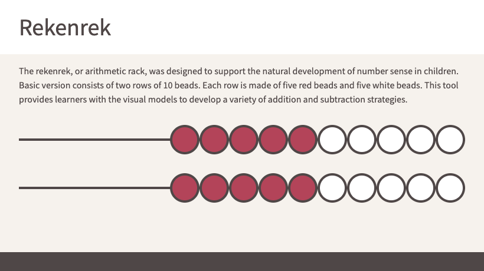

# Rekenrek

Basic representation of the rekenrek, or arithmetic rack.

## How to run this project

One way to run this project is by using live-server. Run the following
in the project directory:

<pre>
live-server --port=1234
</pre>

Then open <a href="http://127.0.0.1:234/" target="_blank">http://127.0.0.1:234/</a>
in the web browser.

Note: If the live-server command is not recognized, it can be installed
via npm:

<pre>
npm install -g live-server
</pre>

## Update styles

The update and recompile SCSS style files, run a sass watcher in the
project directory:

<pre>
sass --watch styles
</pre>

Press ctrl+c to stop watching.

Note: If the sass command is not recognized, it can be installed via npm:

<pre>
npm install -g sass
</pre>
